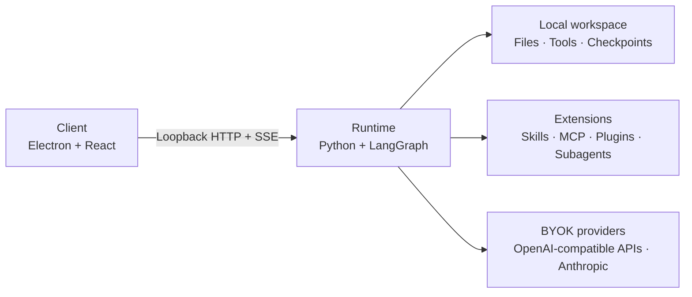

<div align="center">

# 石间 · SheJane

### A local-first Client and Agent Runtime

Run tool-using agents with workspaces, permissions, checkpoints, Skills, MCP, and deterministic plugins on your own machine.

[](https://github.com/jimmyrogue/SheJane/actions/workflows/ci.yml)
[](./LICENSE)


English · [简体中文](./README.zh-CN.md)

</div>

## Why SheJane

- The local Runtime owns the agent loop, tool execution, permissions, checkpoints, and workspace access.
- The Electron app is the official desktop client, not the execution kernel. Future clients can use the same Runtime protocol.
- Skills, MCP servers, subagents, and deterministic plugins extend the Runtime without adding product-specific integrations to its core.

## How it fits together



Client and Runtime communicate over loopback HTTP with a pairing token. A failed Runtime surfaces as a local error and never switches execution paths silently.

The repository has exactly two product modules:

```text
client/                 # UI, Electron lifecycle, and Runtime state projection
runtime/                # execution core, protocol, SDK, plugins, and tests
├── src/shejane_runtime/
├── sdk/
└── plugins/
```

Runtime is independently runnable and testable. The SDK and plugins live below it because Runtime owns their contracts; they remain separately buildable packages, not a third product module.

## What is included

| Area | Current implementation |
|---|---|
| Runtime | LangGraph and Deep Agents loop, streaming events, checkpoints, recovery, planning, verification, memory, and human approval |
| Local tools | Workspace files, read-only-workspace/no-network sandboxed shell execution, Office operations, web fetch, clipboard approval, and scheduled runs |
| Extensions | Skills, MCP servers, deterministic WASI/Managed Worker plugins, the first-party macOS Computer Use adapter, subagents, and configurable middleware |
| Client | Electron and React UI, local Runtime conversation projection, previews, provider settings, and workspace controls |
| Runtime SDK | Public TypeScript client for commands, SSE, snapshots, errors, and generated protocol types |

Business-platform connectors are not built into the Runtime. Future integrations should use standard tools or MCP.

The plugin platform is a preview. WASI packages can install and execute through the Runtime-owned Action protocol. Managed Worker packages stay fail-closed until the current platform's production isolation and release Gate passes. The first-party macOS [Computer Use plugin](./runtime/plugins/computer-use) uses a reserved Runtime-owned adapter and still passes through Action approval and receipts. See the [plugin developer guide](./docs/plugins/developer-guide.md) for the public package contract and local tooling.

## Quick start

Development requires **Node.js 22+ with Corepack**, **Python 3.12+**, and [uv](https://docs.astral.sh/uv/).

```bash
make setup-hooks
corepack enable && pnpm install
make dev
```

No root `.env` is required. Start Client, add an OpenAI-compatible or Anthropic provider in Runtime settings, then select one of its models. Use `make doctor` when the local stack does not start cleanly.

## Development

```bash
make dev-client          # Client only; uses SHEJANE_RUNTIME_URL and SHEJANE_RUNTIME_TOKEN
make dev-runtime         # Runtime only
make test-client         # React and Electron behavior
make test-runtime        # Agent loop, state, tools, plugins, and HTTP
make test-runtime-sdk    # generated types, HTTP client, and SSE parser
make test-contract       # real Runtime HTTP/SSE + SDK, no Electron
make test-e2e            # full Client + Runtime path
make lint && make test && make build
```

Fault isolation is intentional: if Runtime tests fail, stay in `runtime/`; if Client tests fail, stay in `client/`; if both pass but contract fails, inspect the protocol boundary; if contract passes but E2E fails, inspect Client projection or Electron process orchestration.

## Build Runtime from source

Runtime is not published as a standalone GitHub release. Build it on the operating system and CPU architecture where it will run:

```bash
make package-runtime
```

The bundle is written to `runtime/dist/shejane-runtime/`. On Windows, the executable is `shejane-runtime.exe`. PyInstaller includes platform-specific native dependencies, so Runtime cannot be cross-compiled for another operating system or architecture.

## Client packages

The Client release workflow builds Runtime from the same commit and includes it in each installer. GitHub Actions produces two artifacts:

```text
client-macos-arm64
client-windows-x64
```

Run the workflow manually to test packages. Push a `client-vX.Y.Z` tag to create a GitHub Release. Runtime SDK packages continue to use `runtime-sdk-vX.Y.Z` tags.

## Documentation

- [Runtime stages](./docs/harness-runtime-stages.md) defines the target P1-P12 architecture.
- [Current run loop](./docs/run-loop.md) describes what the code does today.
- [Runtime protocol](./docs/runtime-protocol.md) defines HTTP, SSE, events, and recovery cursors.
- [Contributor guide](./CONTRIBUTING.md) covers setup, testing, and the CLA process.
- [Operations](./docs/operations.md) covers deployment and troubleshooting.
- [Plugin developer guide](./docs/plugins/developer-guide.md) defines WASI and Managed Worker packages, Actions, validation, and release checks.

## License

Copyright © 2026 [TAO LIANG](mailto:tliang92@gmail.com).

SheJane uses a dual-license model:

- Community use is available under [GNU AGPL v3.0 only](./LICENSE).
- Proprietary distribution, closed-source modification, embedding, and white-label use require a [separate commercial license](./COMMERCIAL_LICENSE.md).

The SheJane name and logo are covered by the [Trademark and Brand Policy](./TRADEMARKS.md). External contributions require agreement to the [Contributor License Agreement](./CLA.md). Third-party components keep their own licenses as listed in [Third-Party Notices](./THIRD_PARTY_NOTICES.md).
