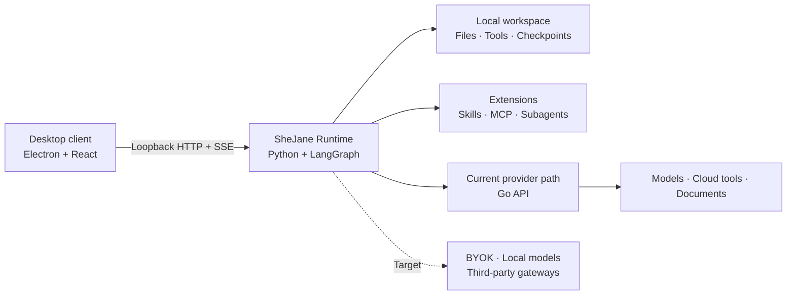

<div align="center">

# 石间 · SheJane

### A local-first desktop Agent Runtime

Run tool-using agents with workspaces, permissions, checkpoints, skills, and MCP on your own machine.

[](https://github.com/jimmyrogue/SheJane/actions/workflows/ci.yml)
[](https://github.com/jimmyrogue/SheJane/releases)
[](./LICENSE)


English · [简体中文](./README.zh-CN.md)

</div>

> [!NOTE]
> The agent loop already runs in a local Python daemon. Model routing, platform-billed tools, authentication, and documents still use the Go API. Standalone Runtime access, BYOK, and local-model support are the target architecture and are not fully shipped yet.

## Why SheJane

- The local Runtime owns the agent loop, tool execution, permissions, checkpoints, and workspace access.
- The Electron app is the official desktop client, not the execution kernel. Future clients can use the same Runtime protocol.
- Skills, MCP servers, and subagents extend the Runtime without adding product-specific integrations to its core.

## How it fits together



The desktop client and Runtime communicate over loopback HTTP with a pairing token. A failed local Runtime should surface as a local error, not silently create a cloud task.

## What is included

| Area | Current implementation |
|---|---|
| Runtime | LangGraph and Deep Agents loop, streaming events, checkpoints, recovery, planning, verification, memory, and human approval |
| Local tools | Workspace files, shell execution, Office and PDF operations, web fetch, clipboard approval, and scheduled runs |
| Extensions | Skills, MCP servers, subagents, and configurable middleware |
| Desktop | Electron and React client, local-first chat history, attachments, previews, and workspace controls |
| Go services | Authentication, model catalog and routing, credit ledger, cloud Tool Gateway, Stripe, documents, and admin APIs |

Business-platform connectors are not built into the Runtime. Future integrations should use standard tools or MCP.

## Quick start

Requires **Go 1.25+**, **Node.js 22+ with Corepack**, **Python 3.12+ with [uv](https://docs.astral.sh/uv/)**, and **Docker**.

```bash
make setup-hooks
corepack enable && pnpm install
cp .env.example .env
make dev-electron
```

The default `MOCK_LLM=true` configuration runs without external provider keys. Use `make doctor` when the local stack does not start cleanly. Never commit `.env`.

## Development

```bash
make lint        # format, static checks, and secret-boundary checks
make test        # Go, Python, desktop client, and admin tests
make build       # production builds
```

## Documentation

- [Runtime stages](./docs/harness-runtime-stages.md) defines the target P1–P12 architecture.
- [Current run loop](./docs/run-loop.md) describes what the code does today.
- [Improvement notes](./docs/harness-stage-improvement-notes.md) records keep, replace, and delete decisions.
- [Contributor guide](./CONTRIBUTING.md) covers setup, testing, and the CLA process.
- [Operations](./docs/operations.md) covers deployment and troubleshooting.

## License

Copyright © 2026 [TAO LIANG](mailto:tliang92@gmail.com).

SheJane uses a dual-license model:

- Community use is available under [GNU AGPL v3.0 only](./LICENSE).
- Proprietary distribution, closed-source modification, embedding, and white-label use require a [separate commercial license](./COMMERCIAL_LICENSE.md).

The SheJane name and logo are covered by the [Trademark and Brand Policy](./TRADEMARKS.md). External contributions require agreement to the [Contributor License Agreement](./CLA.md). Third-party components keep their own licenses as listed in [Third-Party Notices](./THIRD_PARTY_NOTICES.md).
