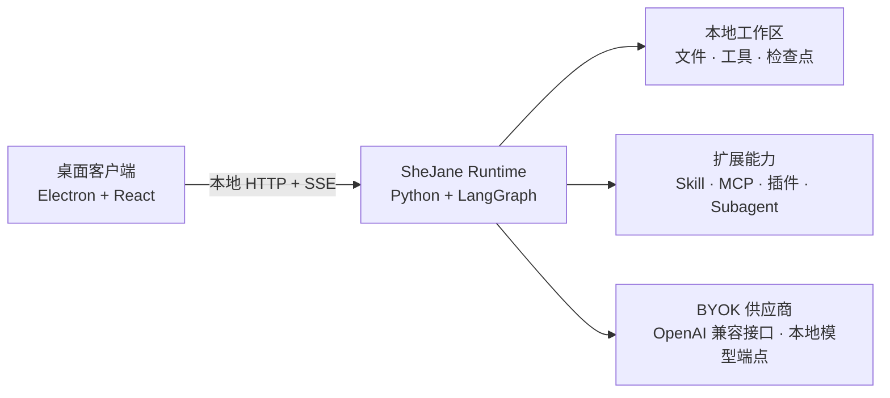

<div align="center">

# 石间 · SheJane

### 本地优先的桌面 Agent Runtime

在自己的电脑上运行带工作区、权限、检查点、Skill、MCP 和确定性插件的工具型 Agent。

[](https://github.com/jimmyrogue/SheJane/actions/workflows/ci.yml)
[](./LICENSE)


[English](./README.md) · 简体中文

</div>

## 为什么做 SheJane

- 本地 Runtime 负责 Agent 循环、工具执行、权限、检查点和工作区访问。
- Electron 是官方桌面客户端，不是执行内核。未来其他客户端可以使用同一套 Runtime 协议。
- Skill、MCP、Subagent 和确定性插件负责扩展能力，业务平台集成不进入 Runtime 内核。

## 整体结构



桌面客户端通过 loopback HTTP 和配对凭证连接 Runtime。Runtime 失败时明确报告本地错误，不静默切换执行路径。

## 当前包含什么

| 领域 | 当前实现 |
|---|---|
| Runtime | LangGraph 和 Deep Agents 循环、流式事件、检查点、恢复、规划、验证、记忆和人工审批 |
| 本地工具 | 工作区文件、Shell、Office、网页抓取、剪贴板审批和定时任务 |
| 扩展能力 | Skill、MCP、确定性的 WASI/Managed Worker 插件、Subagent 和可配置 middleware |
| 桌面端 | Electron 和 React、Runtime 权威对话的本地投影、文件预览、供应商设置与工作区控制 |
| Runtime SDK | 面向命令、SSE、快照、错误和生成协议类型的公共 TypeScript 客户端 |

业务平台连接器统一通过标准工具或 MCP 接入。

插件平台目前处于预览阶段。WASI 插件包已经可以通过 Runtime 权威的 Action 协议安装和执行；Managed Worker 插件在当前平台的生产隔离与发布 Gate 通过前保持 fail-closed。公开包规范和本地工具见[插件开发者指南](./docs/plugins/developer-guide.md)。

## 快速开始

桌面开发需要**支持 Corepack 的 Node.js 22+**、**Python 3.12+** 与 [uv](https://docs.astral.sh/uv/)。

```bash
make setup-hooks
corepack enable && pnpm install
make dev-electron
```

根目录不需要 `.env`。启动 Desktop 后，在 Runtime 设置中添加 OpenAI 兼容供应商并选择模型即可。启动异常时运行 `make doctor`。

## 开发检查

```bash
make lint        # 格式、静态检查和密钥边界检查
make test        # Python Runtime、Desktop 和 Runtime SDK 测试
make build       # 生产构建
```

## 从源码构建 Runtime

Runtime 暂不作为独立程序发布到 GitHub Release。请在实际运行它的操作系统和 CPU 架构上构建：

```bash
cd services/runtime
uv sync --frozen
uv run pyinstaller shejane-runtime.spec --noconfirm --clean
```

构建结果位于 `services/runtime/dist/shejane-runtime/`。Windows 可执行文件名为 `shejane-runtime.exe`。PyInstaller 会打包平台相关的原生依赖，因此不能跨操作系统或 CPU 架构构建。

## Desktop 安装包

Desktop 发布工作流会从同一次提交构建 Runtime，并将它放进安装包。GitHub Actions 生成三个产物：

```text
desktop-macos-arm64
desktop-macos-x64
desktop-windows-x64
```

手动运行工作流可以测试安装包。推送 `desktop-vX.Y.Z` 标签才会创建 GitHub Release。Runtime SDK 继续使用 `runtime-sdk-vX.Y.Z` 标签发布。

## 文档

- [Runtime 阶段总览](./docs/harness-runtime-stages.md) 定义目标 P1-P12 架构。
- [当前运行链路](./docs/run-loop.md) 说明代码现在如何运行。
- [Runtime 协议](./docs/runtime-protocol.md) 定义 HTTP、SSE、事件与恢复游标。
- [贡献指南](./CONTRIBUTING.md) 说明开发、测试和 CLA 流程。
- [运维手册](./docs/operations.md) 说明部署和排障。
- [插件开发者指南](./docs/plugins/developer-guide.md) 定义 WASI/Managed Worker 包、Action、校验和发布检查。

## 授权

Copyright © 2026 [TAO LIANG](mailto:tliang92@gmail.com)。

SheJane 采用双重授权：

- 社区使用遵循 [GNU AGPL v3.0 only](./LICENSE)。
- 闭源分发、闭源修改、集成和白标使用需要取得[独立商业授权](./COMMERCIAL_LICENSE.md)。

SheJane 名称和 Logo 适用[商标与品牌政策](./TRADEMARKS.md)。外部贡献者需要同意[贡献者许可协议](./CLA.md)。第三方组件继续适用[第三方声明](./THIRD_PARTY_NOTICES.md)中列出的各自许可证。
