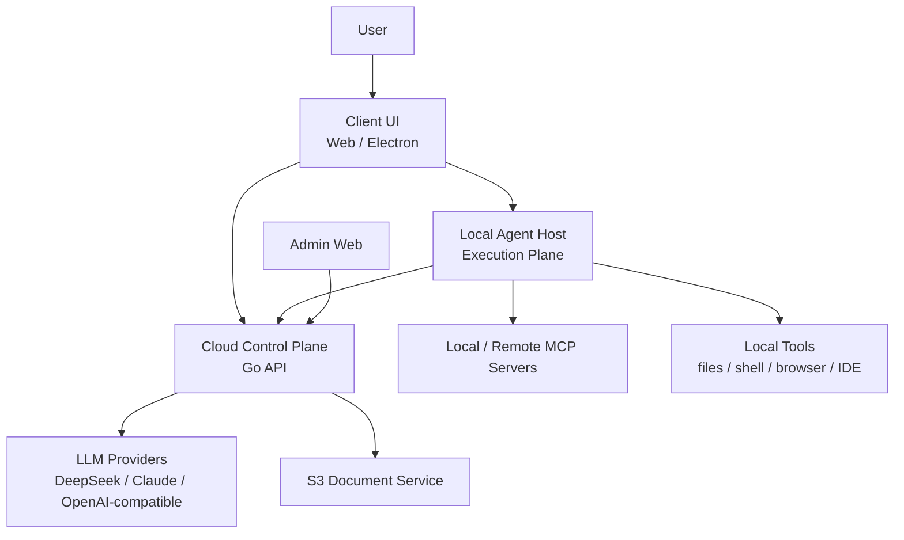

# Jiandanly Agentic Chat Spec

**Version:** v0.1
**Updated:** 2026-05-10
**Status:** Phase 2 direction replacement

## 1. Direction

Jiandanly Phase 2 is no longer a scene-template workbench. The product direction is now **Agentic Chat**: one unified conversation entry where the user can type a normal question, attach files, paste URLs, or describe a task. The system decides whether to answer directly, parse documents, search the web, load a skill, ask for permission, or run a multi-step agent loop.

The long-term architecture is **Local Agent Host + Cloud Control Plane**:

- **Local Agent Host** is the execution plane. It owns local context, tool execution, local MCP, permissions, local files, terminal, IDE/browser integration, run events, and recovery.
- **Cloud Control Plane** is the business and model plane. It owns identity, subscription, wallet, payment, model gateway, temporary document processing, admin, audit, and high-level run metadata.

This keeps the product simple for users while giving the agent the stronger capability profile of tools like Claude Code and Codex-style local agents. Cloud-only agent execution remains useful as a transition mode, but it is not the final architecture.

## 2. References

- [Claude Code Analysis](https://github.com/liuup/claude-code-analysis): community static analysis of Claude Code's agent core, tool permissions, skills, MCP, memory, sandbox, and event-driven execution.
- [Claude Code Docs](https://code.claude.com/docs/en/overview): official product positioning around terminal, IDE, desktop, browser, codebase reading, file edits, commands, and developer-tool integration.
- [Model Context Protocol Architecture](https://modelcontextprotocol.io/docs/learn/architecture): host-client-server split for connecting agent applications to external tools and data sources.
- [OpenAI Agents SDK](https://openai.github.io/openai-agents-python/agents/): agent loop, tools, handoffs, tracing, and structured agent orchestration concepts.
- User-provided Zhihu Claude Code architecture notes: ReAct loop, streaming tool execution, permission hooks, skills, compaction, task coordination, and local execution boundaries.

## 3. Product Principle

The user should not have to choose modes.

Old product shape:

- Chat page for normal questions.
- Document reading page for files.
- Agent page for complex tasks.
- Scene/template cards to tell the model what kind of work it is doing.

New product shape:

- One composer.
- Optional attachments, URLs, and later local file/project references.
- One event stream.
- Automatic intent routing.
- Tools and skills selected by the runtime, not manually selected by the user.

The product may still expose simple controls like fast/deep quality, budget, or "ask before risky actions", but it should not ask non-technical users to reason in terms of scenes, prompt templates, tools, or agent modes.

## 4. Architecture

### 4.1 Client

The client provides a unified Agentic Chat surface:

- Composer supports text, attachments, URLs, and later local project/file references.
- Timeline shows run status, selected skills, tool calls, permission requests, sources, partial answer, final answer, failure, and cancellation.
- Web can operate in a cloud-limited mode.
- Electron can connect to the Local Agent Host for local tools.
- Existing document upload UI is absorbed into the composer instead of living as a separate product mode.

### 4.2 Local Agent Host

The Local Agent Host is the core execution plane. It should eventually run as an Electron-embedded process or a small local daemon.

Responsibilities:

- Run the ReAct/tool loop: model stream, tool call detection, permission check, tool execution, tool result injection, next model call.
- Persist local run events for recovery and debugging.
- Execute local tools only through a typed tool registry.
- Connect local MCP servers under user control.
- Manage local context, artifacts, compaction boundaries, and result summaries.
- Keep sensitive local content local unless the user explicitly sends it to the model or syncs it.

Tool metadata must include:

- `name`
- `description`
- `inputSchema`
- `isReadOnly`
- `isDestructive`
- `isConcurrencySafe`
- `maxResultSize`
- `permissionPolicy`

Execution rules:

- Read-only and concurrency-safe tools may run concurrently.
- Mutating or destructive tools run serially.
- If one sibling tool fails in a way that invalidates the step, the host may cancel remaining sibling tools.
- Tool results are yielded back to the model in tool-call order, not arbitrary completion order.
- Large tool results are saved as artifacts and summarized before entering context.

### 4.3 Cloud Control Plane

The cloud service remains essential, but it should not become the main executor of local work.

Responsibilities:

- Auth, user profile, session, and admin role.
- Wallet, subscription, Stripe orders, and credit reservation/settlement.
- LLM provider routing and provider key protection.
- S3 document upload and extraction when cloud processing is needed.
- Admin dashboard, audit logs, run summaries, and tool failure summaries.
- Cloud-compatible agent run API during the transition period before Local Host is ready.

Cloud must not:

- Ship provider API keys to the client or Local Host.
- Default-store full local files, shell outputs, complete prompts, or complete responses.
- Let admin users browse private local content.
- Treat web pages, documents, tool output, or MCP output as trusted instructions.

### 4.4 Skills, Tools, MCP

Skills are internal capability packs, not user-facing prompt templates.

Examples:

- `web-research`
- `document-analysis`
- `source-grounded-answer`
- `codebase-exploration`
- `local-task-execution`

The runtime selects skills based on task intent, available tools, attachments, user permissions, and budget. Skill selection should be visible in the event stream as `skill.selected`, but it should not require the user to choose a scene.

MCP is split into two classes:

- **Remote MCP:** configured and allowlisted by admin in the cloud.
- **Local MCP:** configured by the user through Local Host and protected by local permission rules.

All external content from tools, web pages, documents, and MCP servers is untrusted context. It can inform answers, but it cannot override system, developer, security, or permission policies.

## 5. Runtime Model

### 5.1 Agent Run

An Agent Run is a resumable unit of work:

- `id`
- `user_id`
- `origin`: `cloud` or `local`
- `status`: `queued | running | waiting_permission | completed | failed | canceled | insufficient_credits`
- `goal`
- `mode`: `fast | deep`
- `budget`
- `created_at`
- `expires_at`

Cloud run records are short-lived operational records. Local run events remain local by default. Cloud may store summaries for billing, audit, and admin diagnostics.

### 5.2 Event Stream

The runtime should expose an ordered event stream:

- `run.created`
- `run.started`
- `skill.selected`
- `llm.started`
- `llm.delta`
- `tool.requested`
- `permission.required`
- `permission.resolved`
- `tool.started`
- `tool.progress`
- `tool.completed`
- `tool.failed`
- `artifact.created`
- `context.compacted`
- `run.completed`
- `run.failed`
- `run.canceled`

Events need stable sequence numbers. The UI renders the timeline from events rather than reconstructing hidden state.

### 5.3 Context Handling

The runtime should separate:

- System and developer instructions.
- User request.
- Local state.
- Tool definitions.
- Skill instructions.
- Untrusted tool/document/web/MCP content.
- Artifacts and summaries.

Context growth must be controlled:

- Cap tool result size.
- Summarize large outputs.
- Track compaction boundaries.
- Preserve source references.
- Avoid repeatedly injecting unchanged document content.

## 6. Public Interfaces

### 6.1 Cloud APIs

Cloud-compatible APIs should be designed so the Web client can use them now and the Local Host can use them later:

- `POST /api/v1/agent/runs`
- `GET /api/v1/agent/runs/{id}`
- `GET /api/v1/agent/runs/{id}/events`
- `GET /api/v1/agent/runs/{id}/stream`
- `POST /api/v1/agent/runs/{id}/cancel`
- `POST /api/v1/agent/llm`
- `POST /api/v1/agent/tool-events`

Existing document APIs remain, but their product role changes: they become the Cloud Document Service used by Agentic Chat, not a separate long-term "document reading mode".

### 6.2 Local Host APIs

The client should detect and talk to Local Host through local-only APIs:

- `GET /local/v1/health`
- `GET /local/v1/tools`
- `POST /local/v1/runs`
- `GET /local/v1/runs/{id}`
- `GET /local/v1/runs/{id}/stream`
- `POST /local/v1/runs/{id}/cancel`
- `POST /local/v1/permissions/{request_id}`

Local APIs must bind only to loopback, use a local session token or pairing token, and never expose shell/file APIs directly to the renderer.

## 7. Security and Privacy

Default stance:

- Provider keys stay in the cloud.
- Local files stay local unless the user explicitly sends content to the model.
- Admin can observe usage and failures, not private local content.
- Dangerous tools require explicit permission.
- Web content, documents, and MCP outputs are untrusted.
- Shell and file-write tools are disabled until Local Host permission UI exists.

Permission policies:

- `allow`: safe, previously approved, low-risk operation.
- `ask`: operation requires user confirmation.
- `deny`: operation is blocked.

Permission scope should support:

- Tool-level rules.
- Path-level rules.
- Command-prefix rules.
- Session-only temporary grants.
- Persistent user-managed grants.

## 8. Phase 2 Roadmap

### Phase 2.0: Specification Replacement

- Add this `spec.md`.
- Update product, frontend, backend, README, and operations docs.
- Mark scene/template workbench as deprecated.
- Define Agentic Chat as the Phase 2 and long-term product direction.

### Phase 2.1: Unified Composer MVP

- Merge normal chat and document reading into one user flow.
- Attachments sent with a message automatically enter document parsing.
- The user sees a single conversation timeline instead of switching product modes.
- Existing Phase 2A S3 document flow is reused behind the composer.

### Phase 2.2: Cloud-Compatible Agent Run

- Add run/event/stream APIs in the cloud backend.
- Implement web search/fetch and document-read tools with strong SSRF and size protections.
- Use the existing wallet reservation/settlement path for every LLM call.
- Admin gains read-only run and tool-failure visibility.

### Phase 2.3: Local Agent Host MVP

- Add Electron/local daemon host.
- Host authenticates with cloud using a short-lived user session token.
- First local tools: time, web fetch/search, document read, read-only local file, controlled shell.
- Permission UI is required before file-write or shell execution can be enabled.

### Phase 2.4: Permissions, Recovery, and Sync Boundaries

- Add local event persistence and run resume.
- Add permission history and session grants.
- Add context compaction and artifact summaries.
- Sync only billing/audit/run-summary metadata to cloud by default.

## 9. Test Strategy

Product acceptance:

- A user can ask a normal question without selecting a mode.
- A user can attach PDF/DOCX/XLSX and ask in the same composer.
- A complex task shows multi-step progress, tool calls, and final answer in one timeline.
- When Local Host is offline, Web degrades to cloud-limited mode.
- When credits are insufficient, Local Host cannot bypass cloud billing.

Security acceptance:

- Provider keys are never returned to client or Local Host.
- Read-local-file requires permission.
- Write-file and shell require explicit confirmation.
- Private local content is not synced to cloud by default.
- Tool output cannot override system or security instructions.

Operational acceptance:

- Admin can see run summaries, LLM usage, tool failures, orders, and wallet status.
- Admin cannot browse unsynced local files, full local prompts, or full local tool outputs.
- Failed, canceled, timed-out, and over-budget runs end in clear states.

## 10. Deprecated Direction

The following ideas are no longer the Phase 2 product direction:

- A scene-card home screen as the primary UX.
- User-selected prompt templates as the main way to unlock capability.
- Separate long-term pages for chat, document reading, and task agent.
- A cloud-only agent runtime as the final architecture.

They may still exist internally as transitional implementation details, but the user-facing product should converge on one Agentic Chat entry.
