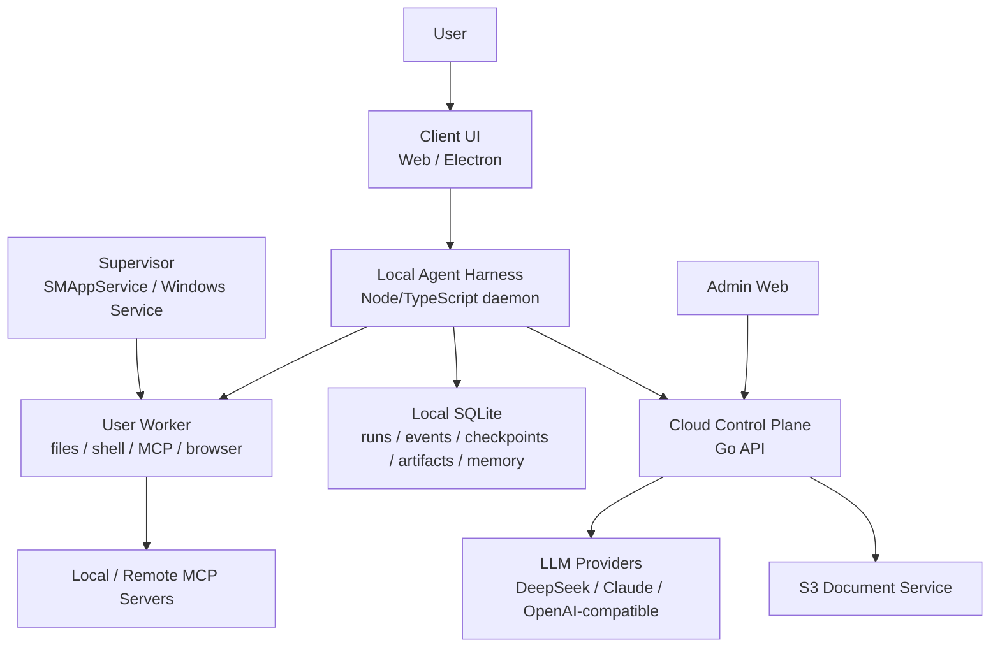

# Jiandanly Local Agent Harness Spec

**Version:** v0.2
**Updated:** 2026-05-12
**Status:** Phase 2 replacement direction

## 1. Direction

Jiandanly Phase 2 is now **Local Agent Harness**.

The user-facing experience remains a single Agentic Chat composer: the user types a question, attaches files, pastes URLs, or describes a task. The system decides whether to answer directly, parse documents, retrieve context, call tools, load skills, ask for permission, verify work, or continue a multi-step loop.

The execution architecture is **Local Agent Harness + Cloud Control Plane**:

- **Local Agent Harness** is the execution plane. It owns orchestration, tool execution, local memory, context management, permissions, local MCP, files, shell, browser/IDE integrations, checkpoints, artifacts, recovery, and lifecycle.
- **Cloud Control Plane** is the business and model plane. It owns identity, wallet, subscriptions, Stripe, model gateway, provider key protection, S3 document service, admin, audit, and high-level run summaries.

The cloud Agent Run added in Phase 2.2 remains a Web fallback and compatibility layer. It must not grow into the final local tool executor.

## 2. References

- [Claude Agent SDK](https://code.claude.com/docs/en/agent-sdk/overview): agent harness framing, tool loop, permissions, and long-running task execution.
- [Anthropic long-running harness](https://www.anthropic.com/engineering/effective-harnesses-for-long-running-agents): harness patterns for memory, context, checkpoints, and recovery.
- [OpenAI Agents SDK](https://openai.github.io/openai-agents-python/agents/): agents, tools, handoffs, tracing, and hosted tool concepts.
- [OpenAI Guardrails](https://openai.github.io/openai-agents-python/guardrails/): input, output, and tool guardrails.
- [MCP architecture](https://modelcontextprotocol.io/docs/learn/architecture): host-client-server split for external tools and data.
- [Apple SMAppService](https://developer.apple.com/documentation/servicemanagement/smappservice?language=objc): macOS service registration direction for future supervisor lifecycle.
- User-provided AI Agent Harness article: the 12-component harness model: orchestration loop, tools, memory, context management, prompt construction, output parsing, state management, error handling, guardrails, verification, subagents, lifecycle.

## 3. Product Principle

The user should not choose modes.

Old product shape:

- Chat page for normal questions.
- Document reading page for files.
- Task Agent page for complex tasks.
- Scene/template cards to tell the model what kind of work it is doing.

New product shape:

- One composer.
- Optional attachments, URLs, and later local workspace references.
- One ordered event stream.
- Automatic skill/tool selection.
- Explicit permission only when the harness wants to touch sensitive local capabilities.

The product may still expose simple controls like fast/deep quality, budget, or risk policy, but it should not ask non-technical users to reason in terms of prompt templates, scenes, tools, or agent modes.

## 4. Architecture

### 4.1 Client

- Unified composer supports text, attachments, URLs, and later local workspace/file references.
- Electron probes Local Agent Harness first.
- If the harness is unavailable, the UI degrades to cloud-limited mode.
- Timeline renders events: run status, selected skills, tool calls, permission requests, artifacts, verification results, errors, and final answer.
- The renderer never receives raw filesystem or shell powers. It talks to loopback APIs or preload-safe metadata only.

### 4.2 Local Agent Harness

The harness is daemon-first and Node/TypeScript based.

Core process split:

- **Supervisor:** install/update/start/stop/restart, health checks, log rotation, crash restart. Future macOS implementation uses SMAppService/LaunchDaemon direction; Windows uses Windows Service direction.
- **User Worker:** runs under the current user session and executes user-scoped tools such as files, shell, MCP, browser, and IDE adapters.

Local persistence:

- SQLite stores runs, events, checkpoints, artifacts, permission decisions, and memory index.
- The local event log is the execution truth.
- Cloud receives only summaries, billing metadata, audit facts, and user-approved synchronized content.

Security boundary:

- Bind only to loopback.
- Pair Electron/Web client with a local pairing token.
- Treat all file, webpage, document, MCP, and shell output as untrusted context.
- The model decides what it wants to do; the harness decides what is allowed.

### 4.3 Cloud Control Plane

Cloud responsibilities:

- Auth, user profile, refresh sessions, admin role.
- Wallet, subscriptions, Stripe orders, credit reservation/settlement.
- LLM provider routing and provider key protection.
- S3 document upload/extraction when cloud document processing is needed.
- Admin dashboard, audit logs, run summaries, LLM usage, and tool failure summaries.
- Cloud Agent Run fallback for Web and compatibility.

Cloud must not:

- Ship provider API keys to the client or harness.
- Default-store full local files, full shell output, full prompts, or full responses.
- Let admins browse unsynced private local content.
- Execute local filesystem/shell/browser tools on behalf of the local harness.

## 5. Harness 12 Components

| Component | Jiandanly implementation |
|-----------|--------------------------|
| 1. Orchestration Loop | Local worker runs a single-agent TAO/ReAct loop: build prompt -> call cloud LLM -> parse tool calls -> permission -> execute tool -> append observation -> repeat. MVP starts single-agent. |
| 2. Tools | Typed registry with `name`, `description`, `inputSchema`, `isReadOnly`, `isDestructive`, `isConcurrencySafe`, `maxResultSize`, `permissionPolicy`. Phase 2.15 shifts the core vocabulary to universal primitives such as `fs.*`, `open.*`, `clipboard.*`, and `task.verify`; Phase 2.17-2.21 uses Playwright-managed Chromium for `browser.search`, `browser.open`, `browser.read`, `browser.verify`, `browser.snapshot`, `browser.screenshot`, `browser.click`, `browser.type`, `browser.scroll`, and `browser.close`, plus `environment.observe`. Legacy `file.*` aliases remain for compatibility; optional `web.search` is advertised only when Tavily is configured. |
| 3. Memory | Three local layers: always-loaded index, on-demand topic notes, searchable raw run/event history. Memory is a hint, not truth; verify before acting. |
| 4. Context Management | Compaction, observation masking, artifact references, and just-in-time retrieval. Large files and shell output become artifacts plus summaries. |
| 5. Prompt Construction | Priority: cloud system policy -> local harness policy -> tool definitions -> permissions -> memory index -> compacted history -> current user goal. Untrusted content is clearly marked. |
| 6. Output Parsing | Prefer OpenAI-compatible native tool calls. No regex parsing of free-text tool calls. No tool call means final answer. |
| 7. State Management | Durable run event log and checkpoints. Support cancel, resume, failed diagnosis. Local state is source of execution truth. |
| 8. Error Handling | Transient errors retry; model-recoverable errors become observations; user-fixable errors enter `waiting_permission`; unexpected errors become failed diagnostic events. |
| 9. Guardrails and Safety | Input guardrails for dangerous intent/budget/workspace; tool guardrails for paths, commands, network, MCP allowlist; output guardrails prevent fabricated tool results or hidden failures. |
| 10. Verification Loops | MVP uses rule verification: exit code, tests, file existence, type checks, and browser page evidence checks. `browser.verify` can validate current managed page text/status and attach screenshot artifacts. Later: LLM-as-judge visual review. |
| 11. Subagent Orchestration | MVP reserves data structures only. Phase 3 can add fork, teammate, and worktree modes after single-agent quality is strong. |
| 12. Lifecycle Management | install, pair, start, stop, restart, update, uninstall, health check, log rotation, crash restart, checkpoint recovery or explicit failure. |

## 6. Runtime Model

### 6.1 Run

A run is a resumable local unit of work:

- `id`
- `origin`: `local` or `cloud`
- `status`: `queued | running | waiting_permission | completed | failed | canceled | insufficient_credits`
- `goal`
- `workspace_path`
- `budget`
- `created_at`
- `updated_at`
- `expires_at`

Local runs keep full events locally. Cloud may store a summary with status, duration, model usage, cost, tool categories, and redacted errors.

### 6.2 Event Stream

Events are ordered by stable sequence numbers:

- `run.created`
- `run.started`
- `skill.selected`
- `llm.started`
- `llm.delta`
- `tool.requested`
- `permission.required`
- `permission.resolved`
- `ui.action.requested`
- `ui.action.completed`
- `tool.started`
- `tool.progress`
- `tool.completed`
- `tool.failed`
- `browser.observed`
- `source.collected`
- `environment.observed`
- `artifact.created`
- `context.compacted`
- `checkpoint.created`
- `verification.started`
- `verification.completed`
- `run.completed`
- `run.failed`
- `run.canceled`

The UI renders from events instead of reconstructing hidden state.

### 6.3 Tool Result Handling

- Tool outputs are untrusted observations.
- Large outputs are saved as artifacts and summarized before context injection.
- Read-only and concurrency-safe tools may run concurrently.
- Mutating or destructive tools run serially.
- Sibling tool failures can cancel later sibling calls if the step is invalidated.
- Tool results are returned to the model in tool-call order.

## 7. Public Interfaces

### 7.1 Local API

Loopback only:

- `GET /local/v1/health`
- `GET /local/v1/tools`
- `POST /local/v1/runs`
- `GET /local/v1/runs/{id}`
- `GET /local/v1/runs/{id}/stream`
- `POST /local/v1/runs/{id}/cancel`
- `POST /local/v1/permissions/{request_id}`
- `GET /local/v1/artifacts/{id}`

Pairing:

- Health can be public for detection.
- Tool, run, permission, and artifact APIs require a local pairing token.
- Renderer code must not receive shell/file powers directly.

### 7.2 Cloud API

- `POST /api/v1/agent/llm`: Local harness calls controlled model gateway; cloud reserves/settles credits and keeps provider keys private.
- `POST /api/v1/agent/tool-events`: Local harness reports redacted tool summaries, failures, and audit events.
- Existing `/api/v1/agent/runs/*`: retained as Web fallback and run-summary compatibility.
- Existing documents API: becomes Cloud Document Service callable by the composer/harness, not a separate long-term product mode.

## 8. Phase Roadmap

### Phase 2.0: Spec Replacement

- Replace scene-template/document-page/task-page direction with Local Agent Harness.
- Keep one Agentic Chat composer as the user-facing mental model.
- Define cloud as Control Plane and local harness as execution plane.

### Phase 2.1: Unified Entry MVP

- Merge normal chat and document reading into one user flow.
- Attachments sent with a message automatically enter document parsing.
- The user sees a single conversation timeline instead of switching modes.

### Phase 2.2: Cloud-Compatible Agent Run

- Cloud run/event/stream APIs support Web fallback and event-model compatibility.
- Document attachments execute through `document.read` events.
- Admin has read-only run observation.

### Phase 2.3: Daemon Foundation

- Add `local-host/` Node/TypeScript module.
- Add loopback health, tools, runs, stream, cancel, permission stub, artifact stub.
- Add pairing token protection for non-health APIs.
- Add local SQLite-backed run/event persistence with in-memory test store.
- Add Electron client Local Host probing and cloud-limited fallback indication.
- Do not execute dangerous tools yet.

### Phase 2.4: Harness Loop MVP

- Implement TAO loop.
- Local harness calls `/api/v1/agent/llm`.
- Parse native tool calls from the cloud gateway response.
- Add `time.now`, `file.read`, `file.search`, and controlled `shell.run`.
- Shell always asks permission and executes only after approval.
- Read-only tools are limited to authorized workspaces.
- Cloud accepts `/api/v1/agent/tool-events` redacted summaries.
- `workspace.open` remains a registered tool and UI/pairing concept; full interactive workspace authorization UI is still a follow-up.

### Phase 2.5: Memory / Context / Checkpoint

- Add compaction, observation masking, artifact references, and checkpoint resume. **Done for Local Host MVP.**
- Add three-layer memory. **MVP done as always-loaded index, matching topic notes, and raw run/event search via local event log.**
- Ensure large files and long command output never flood the prompt. **Done for tool observations above the artifact threshold.**
- Remaining follow-up: richer memory authoring UI, artifact preview UI, and production-grade compaction summaries.

### Phase 2.6: Verification / MCP / Web

- Add verification loops. **Done for rule checks on file/search/shell/web/MCP tool observations.**
- Add local MCP allowlist. **Done as `mcp.call` guardrail.**
- Add local `web.fetch` and optional `web.search`. **Done with SSRF protection for fetch and Tavily-backed search when `TAVILY_API_KEY` is configured.**
- Admin observes summaries, errors, latency, and cost only.

### Phase 2.7: Local Harness UI Bridge

- Connect the unified client composer to Local Host when Electron is paired and no cloud document attachment is active. **Done.**
- Expose a manual workspace path field for the current MVP authorization boundary. **Done.**
- Render local permission requests with approve/deny controls. **Done for `permission.required` / `permission.resolved`.**
- Render local artifacts as references and load full content through `/local/v1/artifacts/{id}` only on demand. **Done.**
- Render verification results in the run timeline. **Done for `verification.completed`.**
- Keep provider keys cloud-only; the client receives only Local Host base URL and pairing token metadata. **Maintained.**

### Phase 2.8: Workspace Authorization

- Add Electron native directory selection through a narrow preload bridge. **Done.**
- Persist authorized workspace roots in Local Host memory and SQLite stores. **Done.**
- Add `GET /local/v1/workspaces` and `POST /local/v1/workspaces`, pairing-token protected. **Done.**
- Validate workspace paths before authorizing them. **Done for existing directories.**
- Reject local run creation when `workspace_path` is not under an authorized root. **Done.**
- Remaining follow-up: path-level rules beyond root allow and run recovery controls.

### Phase 2.9: Workspace Governance

- Add `POST /local/v1/workspaces/diagnose` to explain whether a path exists, is a directory, and is covered by an authorized root. **Done.**
- Add `DELETE /local/v1/workspaces/{id}` to revoke authorized workspace roots. **Done.**
- Surface workspace diagnostics and revocation in the unified client sidebar. **Done.**
- Show the active local project reference in the composer before a Local Harness run is created. **Done.**
- Clear the active local project reference when its authorization is revoked. **Done.**

### Phase 2.10: Run Recovery and Diagnostics

- Add `GET /local/v1/runs?limit=` for recent local run listing. **Done.**
- Add `GET /local/v1/runs/{id}/diagnostics` for redacted diagnostic export. **Done.**
- Keep diagnostic bundles local and omit artifact content and full checkpoint messages by default. **Done.**
- Let the unified client recover a recent local run by replaying/continuing `/local/v1/runs/{id}/stream`. **Done.**
- Let the unified client download a diagnostics JSON bundle for a recent local run. **Done.**

### Phase 2.11: MCP Runtime Adapter

- Execute allowlisted `mcp.call` tool calls through configured local stdio MCP servers. **Done for stdio JSON-RPC MVP.**
- Require both `JIANDANLY_MCP_ALLOWLIST` and local user permission approval before execution. **Done.**
- Configure servers through `JIANDANLY_MCP_SERVERS_JSON`; do not expose command, args, env, tokens, or server stderr in tool metadata. **Done.**
- Convert MCP startup failure, timeout, JSON-RPC error, and tool error into recoverable tool observations. **Done.**
- Keep browser/IDE tools and visual verification as later phases. **Pending.**

### Phase 2.12: Tool Batching

- Execute consecutive permission-free, concurrency-safe tool calls in parallel. **Done.**
- Preserve the original tool call order when injecting observations back into model context. **Done.**
- Keep permission-gated or destructive tools serial and pause for approval. **Done.**

### Phase 2.13: Error Handling Hardening

- Convert model gateway exceptions into durable `run.failed` events. **Done.**
- Mark the run status as `failed` instead of leaving it stuck in `running`. **Done.**
- Keep retry/backoff policies and richer failure diagnosis as follow-ups. **Pending.**

### Phase 2.14: Electron Session and Debuggability

- Electron login syncs a short-lived cloud session into Local Host memory so manual testing does not require copying access tokens. **Done.**
- DeepSeek/OpenAI-compatible dotted tool names are mapped to provider-safe names and back. **Done.**
- Local dev startup and log inspection are exposed through `make dev-electron` and `make logs-*`. **Done.**

### Phase 2.15: Universal Tool Primitives

- Reframe the tool roadmap around general work-agent verbs instead of programmer-first tools. **Done.**
- Add `fs.list`, `fs.read`, `fs.search`, `fs.write`, `open.url`, `open.file`, `clipboard.read`, `clipboard.write`, and `task.verify`. **Done.**
- Keep `file.read`, `file.search`, and `file.write` as compatibility aliases while prompting the model to prefer `fs.*`. **Done.**
- Render permission requests with user-facing action names such as "打开网页", "写入文件", and "写入剪贴板". **Done.**

### Phase 2.16: Browser and Environment Observation

- Add `browser.open`, `browser.snapshot`, and `browser.close` for a Local Host managed page context. **Done in Phase 2.16 as fetch-backed snapshot MVP; upgraded in Phase 2.17.**
- Add `environment.observe` for user-approved local environment metadata. **Done.**
- Emit semantic `browser.observed`, `environment.observed`, and `ui.action.*` events for clearer timelines. **Done.**
- Keep user browser tab inspection, screen OCR, and app-window control as later phases. **Pending.**

### Phase 2.17: Playwright Managed Browser MVP

- Add Playwright as the default Local Host browser runtime and install Chromium explicitly with `npm run browser:install`. **Done.**
- Add `browser.search`, `browser.screenshot`, `browser.click`, `browser.type`, and `browser.scroll`. **Done.**
- Keep `browser.open`, `browser.snapshot`, and `browser.close` on the same tool contract while defaulting to Playwright instead of fetch-backed parsing. **Done.**
- Store screenshots as local artifacts and expose only the artifact id plus summary to the model context. **Done.**
- Require user permission for search/open/click/type; allow snapshot/screenshot/scroll/close. **Done.**
- Block localhost, private-network, non-HTTP(S), `file://`, `chrome://`, and other internal navigation targets. **Done.**
- Keep CloakBrowser as a future optional engine only; it is not a default dependency and no binary is bundled. **Done.**

### Phase 2.18: Browser Task Reliability and Evidence Grounding

- Add `browser.read` for reading the current managed browser page title, URL, meta description, main text, and key links. **Done.**
- Add browser `observation_status`: `usable`, `empty`, `http_error`, `blocked`, `login_required`, and `captcha_like`. **Done.**
- Emit `source.collected` when a read or snapshotted non-search-result page is usable as a source. **Done.**
- Block the third duplicate search query or URL open in the same run with a recoverable observation. **Done.**
- Update prompts so web research uses a small number of targeted searches and sources, changes strategy on bad pages, and stops once evidence is sufficient. **Done.**
- Keep existing Chrome control, login-state browsing, order submission, payments, posting, email sending, desktop screen control, and long-term source libraries out of scope. **Done.**

### Phase 2.19: Browser Verify

- Add `browser.verify` for checking the current managed browser page against expected text and usable page status. **Done.**
- Treat failed verification as a recoverable observation, not a daemon crash. **Done.**
- Allow optional screenshot artifact capture during verification without injecting image bytes into prompt context. **Done.**
- Emit `browser_verify_ok` verification checks in the Harness event stream. **Done.**
- Keep OCR, LLM vision judging, user Chrome tab control, and desktop screenshot verification out of scope. **Done.**

### Phase 2.20: Current Run Diagnostics

- Add a current-message diagnostics action in the client timeline for Local Harness runs. **Done.**
- Fetch `GET /local/v1/runs/{id}/diagnostics` and render run status, event count, permission count, artifact count, latest checkpoint summary, and recent source/verification/error events. **Done.**
- Reuse the redacted diagnostics JSON export path for the current run. **Done.**
- Do not render artifact bodies or checkpoint messages in the diagnostics panel. **Done.**

### Phase 2.21: Research Policy Controller

- Treat search engine result pages as navigation aids, not citation sources. **Done.**
- Count usable non-search sources by canonical URL and block duplicate source collection. **Done.**
- Add a research preflight guard that blocks extra `browser.search`, `browser.open`, or `web.fetch` calls after the run has enough real sources or exceeds configured search/navigation budgets. **Done.**
- Hide optional Tavily-backed `web.search` from the tool list unless `TAVILY_API_KEY` or an injected Tavily key is configured. **Done.**
- Keep provider/web HTTP error observations concise so large 404/blocked pages do not pollute model context. **Done.**
- Expose budget tuning with `JIANDANLY_RESEARCH_MAX_SEARCHES`, `JIANDANLY_RESEARCH_MAX_SOURCE_NAVIGATIONS`, and `JIANDANLY_RESEARCH_TARGET_SOURCES`. **Done.**

## 9. Test Strategy

- macOS/Windows install, start, stop, update, uninstall, health check.
- Unpaired client access to protected Local APIs returns 401.
- Host offline falls back to cloud-limited mode.
- Local run creation streams ordered events and writes local persistence.
- `file.read` stays inside authorized workspace.
- `fs.list`, `fs.read`, `fs.search`, and `fs.write` stay inside authorized workspace.
- `open.url`, `open.file`, and clipboard tools require explicit permission.
- `task.verify` covers simple file, content, URL, and boolean checks.
- `browser.open` and `browser.search` require explicit permission and block localhost/private-network targets before navigation.
- `browser.read` returns `browser_page_required` when there is no managed browser page.
- Usable browser pages emit `source.collected`; `empty`, `http_error`, `blocked`, `login_required`, and `captcha_like` pages do not become source evidence.
- The third duplicate browser search query or URL open in a single run is blocked as `browser_duplicate_observation`.
- `browser.click` and `browser.type` require explicit permission; password and one-time-code inputs are blocked.
- `browser.screenshot` stores a PNG artifact without putting image bytes directly into prompt context.
- `browser.snapshot` observes only the Local Host managed Playwright context.
- `environment.observe` requires explicit permission and emits metadata only, not screenshot content.
- `shell.run` requires explicit permission.
- Denied permission becomes recoverable observation, not a crash.
- Large tool output becomes artifact.
- Insufficient credits cannot be bypassed locally.
- Provider keys never leave cloud.
- Admin can see summaries/status/error/cost/tool type, not private local content.
- Electron paired mode can list recent local runs, recover a run, and export a diagnostics bundle without artifact content.
- Local MCP tests cover allowlist rejection, missing runtime config, stdio execution, metadata redaction, process startup failure, and Harness permission-to-observation flow.
- Harness runner tests cover concurrency-safe tool batching and deterministic observation order.
- Harness runner tests cover model gateway failure becoming a durable `run.failed` event.
- Browser/environment tests cover managed page snapshots, search, screenshot artifact creation, click/type/scroll, SSRF blocking, permission-gated observation, and user-facing timeline labels.

## 10. Deprecated Direction

The following are no longer the Phase 2 product direction:

- Scene-card home screen as the primary UX.
- User-selected prompt templates as the main way to unlock capability.
- Separate long-term pages for chat, document reading, and task agent.
- Cloud-only agent runtime as the final architecture.

They may still exist internally as transitional implementation details, but the user-facing product should converge on one Agentic Chat entry backed by a local harness.
